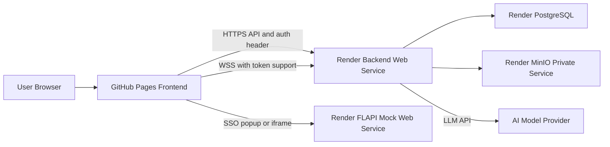

# Render + GitHub Pages Deployment Plan

## Target Architecture

## Deployment Shape

- Add a root `[render.yaml](render.yaml)` Blueprint for Render-managed infrastructure:
  - `flowbolt-backend`: Docker web service from `[backend/Dockerfile](backend/Dockerfile)`, health check `/health`, persistent disk mounted at `/var/lib/flow-44/workspaces`.
  - `flowbolt-flapi-mock`: Node web service from `[mocks/flapi-mock](mocks/flapi-mock)`, start with `MOCK_PORT=$PORT npm start`.
  - `flowbolt-minio`: private Docker service using `minio/minio`, persistent disk mounted at `/data`, API bound to Render’s `$PORT`.
  - `flowbolt-postgres`: managed Render PostgreSQL database.
- Keep MinIO private to Render. Public published apps continue through backend `/shared/{handle}`, so users do not need direct MinIO access.
- Use GitHub Pages for `[frontend](frontend)` via a GitHub Actions workflow that builds Vite with Render service URLs.

## Required Code/Config Changes

- Update `[backend/src/flow44/__main__.py](backend/src/flow44/__main__.py)` so Uvicorn uses `PORT` from Render instead of hardcoded `8000`.
- Update `[backend/Dockerfile](backend/Dockerfile)`:
  - Use Python 3.13 to match `[backend/pyproject.toml](backend/pyproject.toml)`.
  - Do not force `AIB_SANDBOX_MODE=namespaced` for Render; configure Render env as `AIB_SANDBOX_MODE=local` because Render will not provide the Docker privileges used by compose (`SYS_ADMIN`, unconfined seccomp/AppArmor, cgroups).
- Add frontend runtime/build configuration:
  - Replace hardcoded `const BASE = '/api'` in `[frontend/src/services/api.ts](frontend/src/services/api.ts)` with `VITE_API_BASE_URL` support.
  - Replace WebSocket base in `[frontend/src/services/websocket/reconnecting.ts](frontend/src/services/websocket/reconnecting.ts)` with `VITE_WS_BASE_URL` support.
  - Update preview/live URLs in `[frontend/src/components/preview/Preview.tsx](frontend/src/components/preview/Preview.tsx)` to use the backend base URL instead of same-origin paths.
- Fix cross-origin auth paths for GitHub Pages:
  - HTTP API calls already send `Authorization`, so they mostly work once the base URL is configurable.
  - Browser WebSockets, iframe preview, `window.open` downloads, and preview HMR cannot send custom auth headers. Add a backend-supported token query parameter or short-lived signed link flow for these browser-navigated endpoints.
  - Add CORS configuration to `[backend/src/flow44/config.py](backend/src/flow44/config.py)` and `[backend/src/flow44/main.py](backend/src/flow44/main.py)` so allowed origins are explicit, e.g. `https://<owner>.github.io` and the flapi URL.
- Add/update deployment docs with required Render and GitHub secrets:
  - Backend: DB vars from Render Postgres, `AIB_AUTH_JWT_PUBLIC_KEY`, `AIB_FLAPI_BASE_URL`, `AIB_S3_*`, `AIB_AI_*`, `AIB_EXPORT_API_BASE_URL`, sandbox/workspace vars.
  - FLAPI mock: `MOCK_JWT_PRIVATE_KEY` if not using the embedded dev key.
  - Frontend: `VITE_API_BASE_URL`, `VITE_WS_BASE_URL`, `VITE_AUTH_PROVIDER_URL`, `VITE_AUTH_STORAGE_KEY`, `VITE_AUTH_USE_IFRAME`.

## Render Environment Wiring

- Backend DB env maps Render Postgres fields into existing `AIB_DB_*` variables instead of introducing `DATABASE_URL`.
- Backend object storage env points to Render private MinIO:
  - `AIB_S3_ENDPOINT_URL=http://flowbolt-minio:<port>`
  - `AIB_S3_BUCKET_NAME=flow44`
  - `AIB_S3_ACCESS_KEY` / `AIB_S3_SECRET_KEY` from MinIO env.
- Backend flapi env points to the Render flapi URL:
  - `AIB_FLAPI_BASE_URL=https://flowbolt-flapi-mock.onrender.com`
- Backend public URL vars point to Render backend:
  - `AIB_EXPORT_API_BASE_URL=https://flowbolt-backend.onrender.com`
  - `AIB_SANDBOX_AUTH_PROVIDER_URL=https://flowbolt-flapi-mock.onrender.com/sso`

## Migration and Verification Plan

- Run Alembic migrations during deploy using a Render pre-deploy command or a one-off Render job: `uv run --no-sync alembic upgrade head`.
- Verify backend boot: `/health`, DB connection, bucket setup log, and sandbox workspace disk mount.
- Verify flapi: `/health`, `/sso`, and backend data-source calls.
- Verify frontend on GitHub Pages: login, authenticated API fetch, chat WebSocket, terminal WebSocket, preview iframe, publish, `/shared/{handle}`, ZIP/HTML download.
- Run focused checks before deployment: backend tests for auth/preview if changed, frontend tests for API config/auth storage, and one local production build.